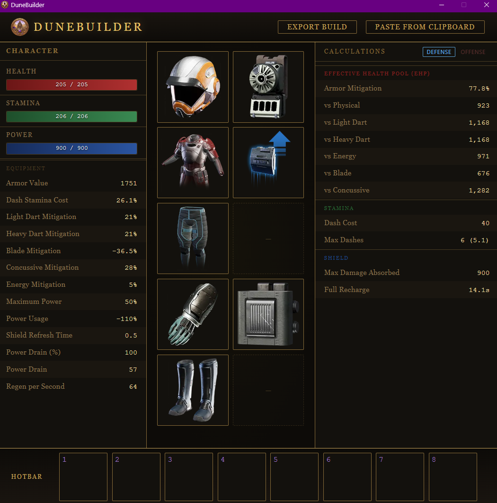

<p align="center">
  
  <br>
  <strong>DuneBuilder</strong>
  <br>
  Character build viewer for Dune: Awakening
</p>



## Features

- Paste character stats directly from clipboard
- Equip gear across 8 armor slots with item browser
- T1-T6 garment items with per-tier filtering
- Grade scaling and augment socketing for T6 uniques
- Defense and offense calculations (EHP, Stamina, Shield)
- Interactive resource bars with regen simulation
- Formula tooltips for all calculations (toggle in settings)
- Export and import builds for sharing
- Auto-update check on launch

## Download

Grab the latest portable `.exe` from the [Releases](../../releases) page.

## Usage

1. Copy your character stats from Dune: Awakening
2. Paste into DuneBuilder (Ctrl+V or the paste button)
3. Click armor slots to browse and equip gear
4. View calculated totals in the right panel
5. Export your build to share with others

## Build from Source

**Prerequisites:** Node.js 18+ and npm

```bash
git clone https://github.com/0xdreadnaught/dunebuilder.git
cd dunebuilder
npm install
npm start
```

To create a portable Windows build:

```bash
npm run build
```

Output will be in the `dist/` folder.
